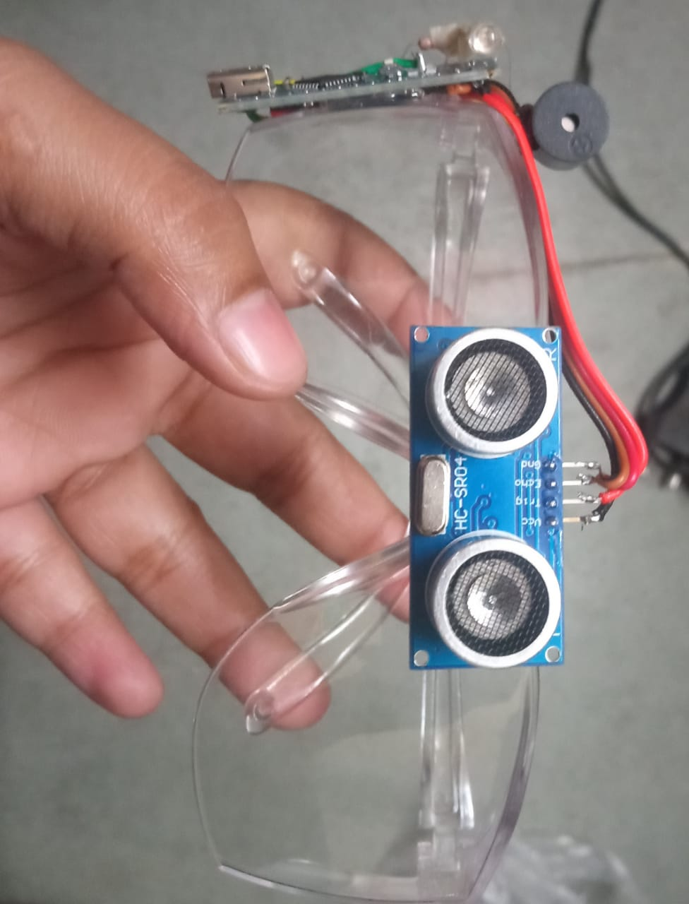

👓 Smart Glasses for Blind People
A wearable assistive-technology device designed to enhance mobility and safety for visually impaired individuals.
The system uses an Ultrasonic Sensor, Buzzer, and LED with an Arduino Nano to detect obstacles and provide real-time alerts.

📘 Overview
This project focuses on solving a real-world problem using embedded electronics.
The device continuously scans the surroundings and alerts the user through sound and light signals whenever an obstacle is detected within a predefined range (25 cm).
The goal is to create a low-cost, lightweight, and reliable wearable for visually impaired users.

🧠 Learning Outcomes
By building this project, the user gains hands-on experience with:
-Working of Ultrasonic Distance Measurement
-Basics of Arduino Nano microcontroller
-Interfacing buzzer and LED for alert systems
-Digital and analog pin usage
-Understanding of real-time embedded systems
-Circuit design using jumper wires and breadboard/soldering

⚙️ How the System Works
1.The HC-SR04 Ultrasonic Sensor emits sound waves.
2.When these waves hit an obstacle, they bounce back to the sensor.
3.Arduino calculates distance using the time taken by the echo.
4.If the obstacle is closer than 25 cm:
     -Buzzer activates
     -LED turns ON
5.If no obstacle is detected:
     -Buzzer OFF
     -LED OFF
6.All the components are mounted on safety glasses, making it wearable and hands-free.

⭐ Key Features
-🔍 Real-time obstacle detection
-🔔 Automatic buzzer alert for safety
-💡 LED indicator for visual notification
-🥽 Mountable on safety glasses (lightweight and portable)
-🔋 Low power consumption
-💻 Easy to program and modify
-💰 Cost-effective assistive solution

🛠️ Components Used
-Arduino Nano
-Ultrasonic Sensor
-Buzzer
-LED
-Safety Glasses Frame
-Wires

